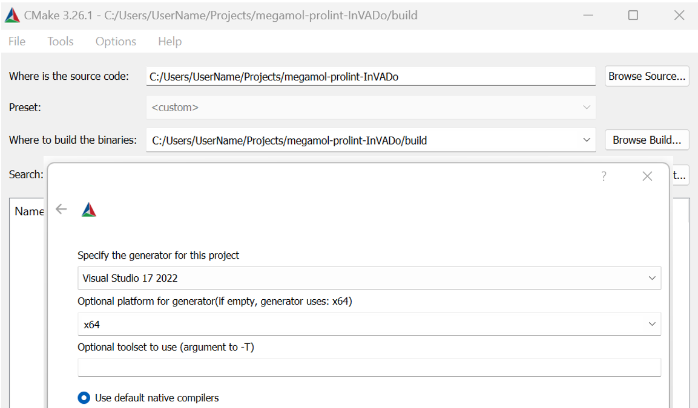
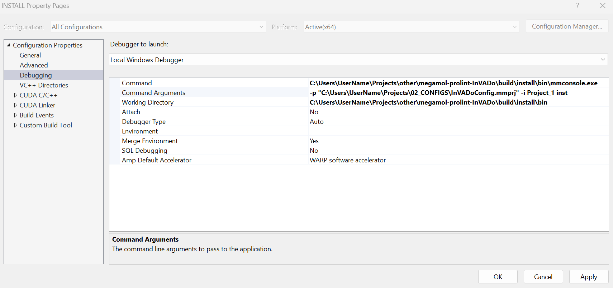
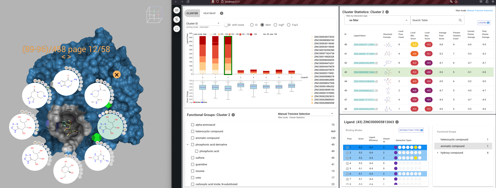
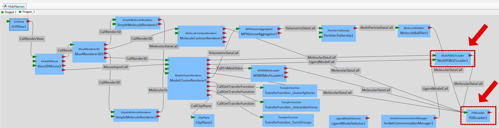

# InVADo: Interactive Visual Analysis of Molecular Docking Data

# InVADo_setup - Repository

contains additional data to complement the main InVADo repository

- figures of functional groups (needed for web dashboard)
- small precalculated data set (for web part development or when running the web dashboard without InVADo desktop)
- InVADo config file
- graphics settings file

### main repository of InVADo: https://github.com/MarcoSchaeferT/megamol-prolint-InVADo

###

- run CMake to prepare InVADo for building
- InVADo is available under the repository link above
- running CMake will automatically download the additional content of this repository
- additional content is saved to: **NAME_OF_REPOSITORY\plugins\prolint\InVADo_setup**

(the following mentioned references refer to this path)

## Requirements Building InVADo:

- operating system: windows 10 or 11
- GPU: NVIDIA
- CUDA (tested CUDA 11.6) https://developer.nvidia.com/cuda-11-6-0-download-archive
- Linux subsystem (tested 22.04 LTS) https://learn.microsoft.com/en-us/windows/wsl/install
- CMake (tested 3.26) https://cmake.org/download/
- Visual Studio (tested version of 2022) https://visualstudio.microsoft.com/de/vs/
- node.js v16 (tested 16.20.1) https://nodejs.org/en/blog/release/v16.20.0
- Microsoft MPI (install both msmpisdk.msi; msmpisetup.exe) https://www.microsoft.com/en-us/download/details.aspx?id=105289
- Firefox (tested 116.0.1) https://www.mozilla.org/de/firefox/new/
- Python 3.10 (tested 3.10.11) https://www.python.org/downloads/release/python-31011/

  #### (during Python installation following additional options must be checked [x])

  - [x] Add to Path
  - use --> Customize Installation
  - click 'Next'
  - [x] Precompile Standard Library
  - [x] Download debugging symbols
  - [x] Download debug binaries

- PLIP running in the Linux subsystem must be installed via the script: **NAME_OF_REPOSITORY\plugins\prolint\InVADo_setup\run_plip_install.cmd**
- the rest of the needed programs are downloaded via CMake

## Building InVADo:

- run CMake for MegaMol/InVADo (configure)
  - set visual studio 2022
  - set x64
    
- ignore warnings during the 'configure' process
- _check/do the following boxes/steps:_
  - [x] ENABLE_MPI
  - set 'MPI_GUESS_LIBRARY_NAME' to 'MSMPI'
  - [x] ENABLE_CUDA
  - [x] BUILD_PROLINT_PLUGIN
  - [x] BUILD_PROTEIN_CUDA_PLUGIN
  - configure again
  - generate
  - open project
  - (may need to install .NET Framework 4.8.1 SDK)
- set the 'INSTALL' target of 'CMakePredefinedTargets' as the start project
- build and install it as "RELEASE" not "DEBUG"
- "DEBUG" is possible as well, but if the docking data set is not already preprocessed by InVADo as a RELEASE version it will fail to start as a DEBUG version
- the docking data set will be preprocessed one time with the first start of InVADo as RELEASE version
- for easier development set 'INSTALL' target settings as follows:
  

## Create a New Data Set

PATH = \_NAME_OF_REPOSITORY\plugins\prolint\InVADo_setup\prepare_docking_data_scripts

- the folder **'prepare_docking_data_scripts'** contains a pipeline
- this is an exemplary, simple pipeline for processing a molecular docking
- a small example data set is included
  - **PATH/data/AAABMN.xaa.pdbqt** (includes the ligands)
  - **PATH/7nn9_autoDockTools.pdbqt** (is the target protein)
- running the script **PATH\run_full_automated_docking.cmd** automatically performs a molecular docking of the data above
- the docked data is then stored in the folder **PATH/results**
- the example ligands are from the ZINC database: https://zinc15.docking.org/
- the docking tool is AutoDock Vina: https://vina.scripps.edu/
- if own ligands are used they should follow the ZINC naming scheme

## Run InVADo:

PATH = \_NAME_OF_REPOSITORY\plugins\prolint\InVADo_setup\

- InVADo can be started with **mmconsole.exe**
- **mmconsole.exe** is stored after building in **"\_NAME_OF_REPOSITORY/build/install/bin/"**
- the InVADo config **InVADoConfig.mmprj** file is located in the folder **'PATH/InVADo_config'**
- the InVADo config can be adjusted with the configurator **PATH/InVADo_config/MegaMolConf.exe**
  - Module _MultiPDBQTLoader1_ Parameter: _pdbqtListFilename_: must be set to your path of a ligand PDBQT file list (\*.txt)
    #### [e.g.:PATH\prepare_docking_data_scripts\results\results_list.txt*]
  - Module _PDBLoader1_: Parameter: _pdbFilename_: must be set to your path of a protein file (\*.pdb)
    #### [e.g.: *PATH\prepare_docking_data_scripts/7nn9_autoDockTools.pdbqt*]
    
- example command for execution (program + config file): _C:\Projects\InVADo\build\install\bin\mmconsole.exe -p "C:\PATH\InVADo_config\InVADoConfig.mmprj" -i Project_1 inst_
- the first start can take a while because InVADo preprocesses the data (loading bars in the cmd window will indicate the progress)
- the processed data will be stored in [e.g.: *PATH\prepare_docking_data_scripts\results\InVADo_tmpFiles*]

## Starting only the Web Dashboard

PATH = \_NAME_OF_REPOSITORY\plugins\prolint\server\

- there is the possibility to run only the web part of InVADo without the 3D visualization
- it will use the provided test data set
- build the web app: run _'PATH\build_app.cmd'_
- start the web app: run _'PATH\run_app.cmd'_

## optional: improve rendering quality

PATH = \_NAME_OF_REPOSITORY\plugins\prolint\InVADo_setup\

- got to folder **'graphicSettings'** located in PATH
- run **setGraphics.cmd** to set an Nvidia profile for InVADo

## Trouble Shooting

- if the build fails with: **can not find \_Py_wfopen()** make sure Python 3.10 is installed and no other Python version is set for the Windows PATH variable
